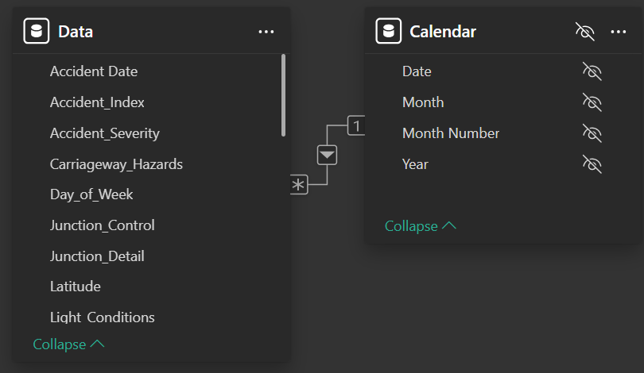
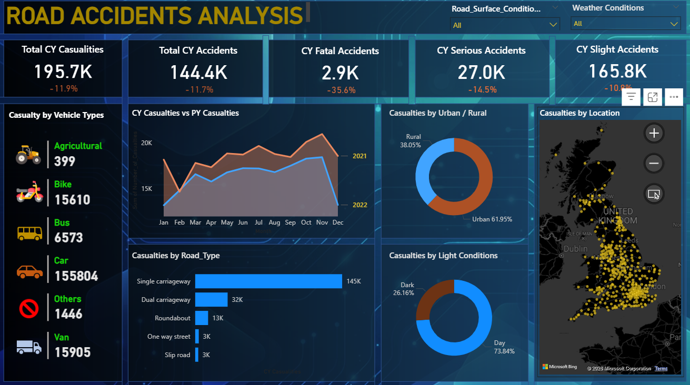

# UK ACCIDENT ANALYSIS (2021-2022)

A comprehensive technical portfolio examining casualty trends, accident severity, and road-safety intelligence across Great Britain. This project integrates robust data architecture, DAX time-intelligence logic, and strategic policy recommendations to equip transport policymakers with actionable insight.

## Table of Contents
- [Executive Summary](#executive-summary)
- [Business Request](#business-request)
- [Data Modelling](#data-modelling)
- [Data Cleaning/Preparation](#data-cleaningpreparation)
- [Exploration Data Analysis (EDA)](#exploration-data-analysis-eda)
- [Data Analysis (DAX)](#data-analysis-dax)
- [Insights](#insights)
- [Strategic Action Plan](#strategic-action-plan)
- [Limitations](#limitations)
- [References](#references)

---

## Executive Summary
This project functions as a decision-support tool for the Transport Department and Law Enforcement to mitigate road risks through data-driven policy. Analysis of 195,700 casualties across 144,400 accidents reveals a positive 11.9% Year-on-Year (YoY) decline in total casualties, with a notable 35.6% reduction in fatal incidents. Despite these gains, the data identifies critical risk concentrations on single carriageways (145k casualties) and within urban environments (61.95%). The following report details the technical architecture and strategic interventions required to sustain this downward trend.

## Business Request
The goal was to transition raw accident records into a functional dashboard that answers critical safety questions for stakeholders.  

### Key Performance Indicators (KPIs):
- **Primary Metrics:** Track Total Casualties and Total Accidents for 2022 with a Year-on-Year (YoY) comparison against 2021.
- **Severity Analysis:** Isolate Fatal, Serious, and Slight accidents for the current year to assess the lethality of incidents.
- **Environmental Impact:** Analyze how Light, Road Surface, and Weather conditions correlate with casualty frequency.
- **Spatial Dynamics:** Compare Urban vs. Rural safety metrics to guide regional infrastructure investment.

## Data Modelling
To ensure analytical integrity and scalability, I implemented a Star Schema centered on a primary accident fact table. 



- **Calendar Table:** A dedicated date table was engineered to support many-to-one relationships, enabling seamless time-intelligence queries.  

- **Data Categorization:** Standardized categorical fields (e.g., Road_Surface, Weather_Conditions) and grouped specific vehicle types to enhance reporting granularity.  

- **Geospatial Intelligence:** Integrated Latitude and Longitude coordinates to power spatial distribution maps.

## Data Cleaning/Preparation
The analytical pipeline was engineered for robustness and reproducibility:
1. **Data Ingestion:** Raw records were imported into Power BI.
2. **Handling Missing Values:** Null values in categorical fields were addressed and cleaned.
3. **Data Normalization:** Categorical fields were standardized to ensure consistency.
4. **Enforced Data Types:** Ensured all date, numerical, and text fields were correctly typed for downstream reliability.

## Exploration Data Analysis (EDA)
EDA was conducted to understand the distribution of casualties across various dimensions:
- **Severity Breakdown:** Analyzing the distribution between Slight, Serious, and Fatal casualties.
- **Monthly Trends:** Identifying seasonal peaks (specifically the Q4 October-December concentration).
- **Spatial Analysis:** Comparing accident frequency in Urban vs. Rural settings.
- **Road Typology:** Assessing casualty concentration on single vs. dual carriageways.
During this phase, I identified that fatal and serious accidents were declining at a faster rate (-35.6% and -14.5% respectively) than slight accidents (-10.9%), indicating that road safety interventions are effectively reducing high-impact collisions.


## Data Analysis (DAX)
Core measures were developed to facilitate temporal comparisons

### Current Year (CY) Casualties
```dax
CY Casualities =
TOTALYTD(
    sum(Data[Number_of_Casualties]),
    'Calendar'[Date])
```

### Current Year (CY) Accidents
```dax
CY Accidents = 
TOTALYTD(
    COUNT(Data[Accident_Index]),
    'Calendar'[Date])
```

### Previous Year (PY) Casualties
```dax
PY Casualties = CALCULATE(
    SUM(Data[Number_of_Casualties]),
    SAMEPERIODLASTYEAR('Calendar'[Date])
)
```

### Previous Year (PY) Accidents
```dax
PY Accidents = CALCULATE(
    COUNT(Data[Accident_Index]),
    SAMEPERIODLASTYEAR('Calendar'[Date])
)
```

### Year on Year (YoY) Growth %
```dax
YoY Growth % = 
DIVIDE(
    [CY Casualties] - [PY Casualties],
    [PY Casualties],
    0
)
```

### Year on Year Casualties Growth %
```dax
YoY Casualties =
    ([CY Casualities] - [PY Casualties]) / [PY Casualties]
```

### Year on Year Accidents Growth %
```dax
YoY Accidents =
    ([CY Accidents]-[PY Accidents])/[PY Accidents]
```

## Insights



Based on the analysis in the dashboard above, we draw that;

1. Significant Improvement in Lethality: Fatal accidents saw a massive 35.6% decline, far outpacing the overall casualty reduction.
2. Urban Dominance: Urban environments account for 61.95% of total casualties, highlighting high-density traffic as a primary risk factor.
3. The Daylight Paradox: 73.84% of casualties occur during daylight, indicating that driver behavior and peak-hour volume are greater risks than poor visibility.
4. Infrastructure Risk: Single carriageways are the primary risk vector, accounting for 145,000 casualties.
5. Vehicle Involvement: Cars remain the dominant risk vector (155,804 casualties), warranting primary regulatory focus.

## Strategic Action Plan

- **Infrastructure Priority:** Reallocate capital expenditure to prioritize Single Carriageway safety interventions, such as central reservation barriers.  
- **Urban Safety:** Expand 20 mph zones and prioritize junction redesigns in urban centers.  
- **Seasonal Enforcement:** Implement dynamic speed limits and pre-position gritting fleets during the November peak risk window.  
- **Behavioral Campaigns:** Focus safety awareness on peak-hour "Daylight" driving habits to mitigate the impact of driver complacency.

## Limitations
1. **Under-Reporting:** The dataset relies on reported accidents; slight incidents may be under-represented.
2. **Behavioral Data:** While trends suggest driver recklessness, the dataset lacks direct telematics data (e.g., speed or mobile phone usage).

## References
- Dataset: UK Road Accident Records 2021-2022 by Data Tutorials [Data](https://drive.google.com/drive/folders/1pCNs-TRPznlbAn712gAGy7XfBnWs2QJm)
